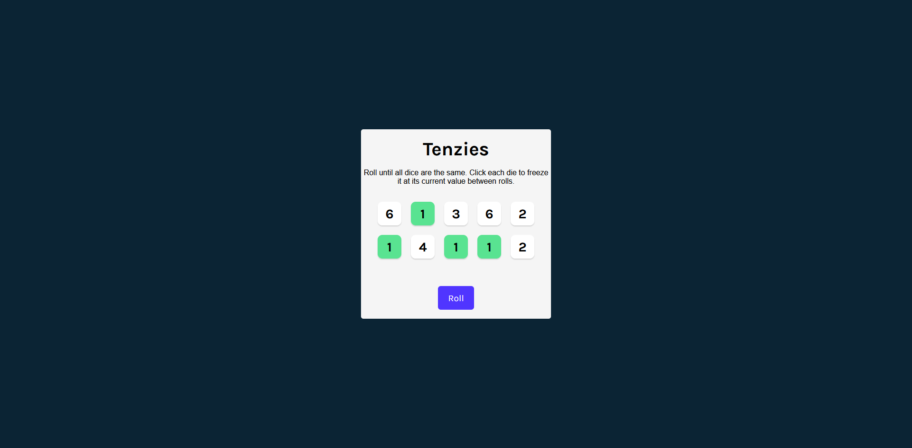

# 🎲 Tenzies Game


A simple and fun dice game built with **React**!

## 📜 About the Project

In this version of **Tenzies**, the goal is to roll 10 dice until all dice show the same number.  
You can "hold" dice to lock their value between rolls.

Key Features:
- Roll the dice until they all match.
- Click on a die to "hold" its value and prevent it from rolling.
- Visual feedback for held dice.
- Win detection when all dice are held and show the same number.

## ✨ Technologies Used

- **React** (Functional Components and Hooks)
- **JavaScript (ES6+)**
- **CSS3** for basic styling

## 🚀 How to Run

1. Clone the repository:
   ```bash
   git clone https://github.com/your-username/tenzies-game.git
   ```
2. Navigate to the project folder:
   ```bash
   cd tenzies-game
   ```
3. Install dependencies:
   ```bash
   npm install
   ```
4. Start the development server:
   ```bash
   npm start
   ```

## 🎮 How to Play

1. Click the **Roll** button to roll the dice.
2. Click on individual dice to **hold** their current number.
3. Continue rolling until **all dice show the same value** and are **held**.
4. Celebrate your win! 🎉

## 🛠 Future Improvements

- Add a timer to track how fast the game is won.
- Count the number of rolls. (DONE)

## 📷 Preview



---

# License

This project was created as part of a learning path from **Scrimba**.  
You are free to use, modify, and share it for educational or personal purposes.
